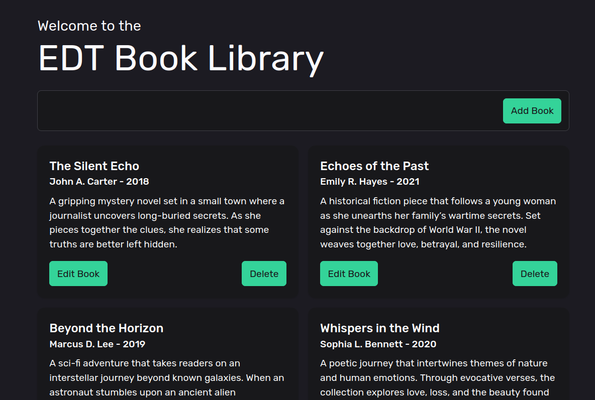
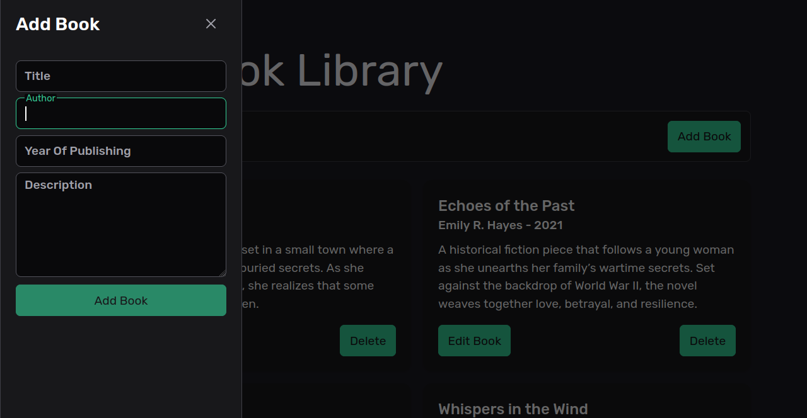

# EDT.Library

## Project:

This project is a simple library management system. You can add, edit and remove books from the library.




## Build and Run

### Prerequisites

- [.NET 8.0 SDK](https://dotnet.microsoft.com/download/dotnet/8.0)
- [Node.js](https://nodejs.org/) (for the UI project)
- [pnpm](https://pnpm.io/)

### Build

1. Clone the repository:
    ```sh
    git clone https://github.com/Ollie-Ave/EDT.Library.git
    cd EDT.Library
    ```

2. Restore the dependencies:
    ```sh
    dotnet restore
    ```

3. Adjust connection string:
	Change the connection string in appsettings.Development.Json to point towards the database you want to use. There's one that's already got some data in it with this project. You will need to adjust the path as it's fully qualified.

3. Build the solution:
    ```sh
    dotnet build
    ```

### Run

1. Navigate to the API project directory:
    ```sh
    cd EDT.Library.Api
    ```

2. Run the API project:
    ```sh
    dotnet run --launch-profile https
    ```

3. Navigate to the UI project directory in a new terminal:
    ```sh
    cd ../EDT.Library.UI
    ```

4. Install the UI dependencies:
    ```sh
    pnpm install
    ```

5. Run the UI project:
    ```sh
    pnpm dev
    ```

### Testing

To run the tests please run at the root of the project:
	```sh
	dotnet test
	```